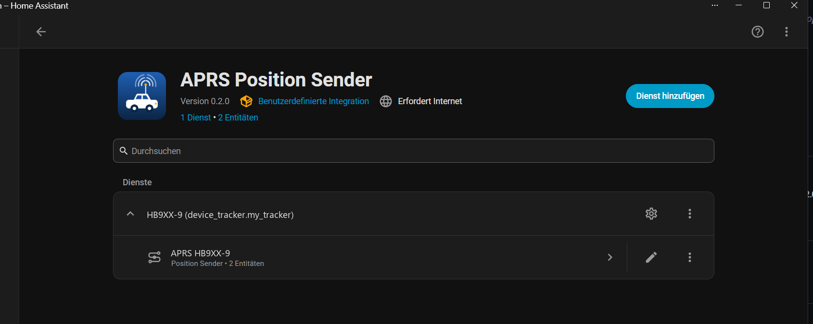

# APRS Position Sender for Home Assistant

> ⚠️ **For licensed amateur radio operators only.** APRS-IS is part of the
> amateur radio service. Transmitting to it requires a valid amateur radio
> licence, and you may only ever use your own callsign and passcode. This
> project is by and for licensed hams — it is not a generic tracking tool.

A Home Assistant custom integration that watches any `device_tracker` entity
and beacons its position to the APRS-IS network as an uncompressed APRS
position report. The station then shows up on [aprs.fi](https://aprs.fi) and
any other APRS-IS client.

It works with any `device_tracker` that exposes `latitude` / `longitude`
attributes, so any position source you already have in Home Assistant can
become an APRS station:

- **LoRa mesh nodes**, e.g. MeshCore via `meshcore-ha`: the node reports its
  GPS position into Home Assistant, this integration relays it to APRS under
  your callsign. This is the setup the integration was written for.
- **Home Assistant Companion app** on your phone: beacon yourself as
  `HB9XX-7` (the customary SSID for handhelds) with no extra hardware at all.
- **Car integrations** such as Tesla, BMW ConnectedDrive, Volkswagen, Renault,
  Kia/Hyundai or any other cloud car integration that provides a
  `device_tracker`: your car shows up on aprs.fi as `HB9XX-9` while you
  drive, without an APRS tracker in the vehicle.
- **Other trackers**: Traccar, OwnTracks, GPSLogger, Tile, or a
  `device_tracker.see` call from your own automation.

Each config entry pairs one callsign with one tracker, so you can run several
of them side by side, for example one for the car and one for the phone.

## Features

- UI setup only, no YAML.
- **Smart broadcast**: sends when the tracker moved at least `min_distance_m`
  and at least `min_interval_s` passed since the last report.
- **Heartbeat**: re-sends the last known position every `max_interval_s` even
  without movement, so the station does not go stale on aprs.fi.
- The first valid position after setup is sent immediately.
- Credentials and server reachability are verified during setup.
- Options flow to change server, comment, symbol and thresholds later.
- A **Beaconing** switch per entry to pause and resume position reports. Its
  state survives restarts; turning it back on sends the current position at
  once.
- A **Send position now** button that beacons the current position at once,
  ignoring the thresholds and the switch.
- Multiple entries (different callsign/tracker pairs) can run in parallel.

## Installation (HACS custom repository)

This integration is not in the HACS default store.

1. In Home Assistant open **HACS → Integrations**.
2. Open the three-dot menu (top right) → **Custom repositories**.
3. Add `https://github.com/HB9DUT/HAtoAPRS`, category **Integration**.
4. Search for **APRS Position Sender** in HACS and install it.
5. Restart Home Assistant.

Manual alternative: copy `custom_components/aprs_send` into your
`config/custom_components/` folder and restart.

## Setup

> You need your own amateur radio callsign and its APRS-IS passcode. Do not
> enter someone else's callsign or passcode.

**Settings → Devices & Services → Add Integration → "APRS Position Sender"**



| Field | Default | Description |
|---|---|---|
| Callsign (with SSID) | – | e.g. `HB9XX-9` |
| APRS-IS passcode | – | numeric passcode for your callsign |
| Device tracker | – | the `device_tracker` entity to relay |
| APRS-IS server | `rotate.aprs2.net` | |
| APRS-IS port | `14580` | |
| Comment | empty | free text, max. 43 characters |
| Symbol table | `/` | `/` primary, `\` alternate |
| Symbol code | `>` | `>` = car; see the APRS symbol table |
| Minimum distance (m) | `100` | movement needed to trigger a report |
| Minimum interval (s) | `30` | anti-jitter gap between two reports |
| Heartbeat interval (s) | `600` | re-send without movement |
| Speed unit of the tracker | `ms` | unit of the tracker's `speed` attribute: `ms` = m/s (Companion app and most HA trackers), `kmh`, `kn` (e.g. Traccar) or `mph` |

The setup form validates that the passcode matches the callsign and performs a
test login to the APRS-IS server before the entry is created.

### Getting your APRS-IS passcode

The passcode is a number derived from your **base callsign** (the part before
the `-SSID`). `HB9XX-9`, `HB9XX-7` and `HB9XX` all share the same passcode.
It is not a secret in the cryptographic sense, but by convention it is only
handed out to licensed amateurs, so please only use it with your own callsign.

Ways to obtain it:

- **Compute it locally** with the same library this integration uses:

  ```
  pip install aprslib
  python -c "import aprslib; print(aprslib.passcode('HB9XX'))"
  ```

- **Online generator**, e.g. <https://apps.magicbug.co.uk/passcode/>.
- **Existing APRS software**: if you already run APRSdroid, Xastir, YAAC,
  Direwolf or similar with APRS-IS, the passcode is in that configuration.

Enter the number as-is in the "APRS-IS passcode" field. The form rejects a
passcode that does not match the callsign before contacting the server.

Everything except callsign, passcode and tracker can be changed afterwards via
**Configure** on the integration card.

## Entities

Each entry creates a device `APRS <callsign>` with these entities:

- `switch.aprs_<callsign>_beaconing`: while off, the tracker is still followed
  but nothing is sent to APRS-IS. The state survives restarts.
- `switch.aprs_<callsign>_send_speed_and_course`: include the tracker's
  `speed` and `course` attributes as the APRS course/speed extension
  (`088/045`, degrees and knots). Only added when the tracker provides a
  speed; without a course the packet carries `000` for "unknown".
- `switch.aprs_<callsign>_send_altitude`: include the tracker's `altitude`
  attribute as `/A=nnnnnn` (feet) in the comment.
- `button.aprs_<callsign>_send_position_now`: sends the last known position
  immediately, regardless of distance, interval or the switch. If no position
  is known yet or the send fails, the press reports an error.

All switches remember their state across restarts. The two "send ..." switches
only affect the next report; they do not trigger one. If the tracker does not
provide the attribute, nothing is added, regardless of the switch.

Use them in automations, for example to stop beaconing at home or at night:

```yaml
automation:
  - alias: Pause APRS at home
    triggers:
      - trigger: state
        entity_id: device_tracker.meshcore_node
        to: home
    actions:
      - action: switch.turn_off
        target:
          entity_id: switch.aprs_hb9xx_9_beaconing
```

## Packet format

```
HB9XX-9>APRS,TCPIP*:!4656.78N/00725.43E>comment
HB9XX-9>APRS,TCPIP*:!4656.78N/00725.43E>088/045/A=001772comment
```

Uncompressed position report without timestamp and without the messaging
capability flag. The second form includes the optional course/speed extension
and the altitude field.

## Testing without a real tracker

Create a helper tracker with the `device_tracker.see` service (Developer Tools
→ Actions) and change its coordinates:

```yaml
action: device_tracker.see
data:
  dev_id: aprs_test
  gps: [46.9481, 7.4474]
```

Enable debug logging to follow the decisions:

```yaml
logger:
  logs:
    custom_components.aprs_send: debug
```

## License

GNU General Public License v3.0 or later (GPL-3.0-or-later), see
[LICENSE](LICENSE).

## Thanks

- [Rossen Georgiev](https://github.com/rossengeorgiev) for
  [aprslib](https://github.com/rossengeorgiev/aprs-python), which does the
  actual APRS-IS encoding and connection handling this integration builds on.
- [Claude](https://claude.com/claude-code), for help building this
  integration.
